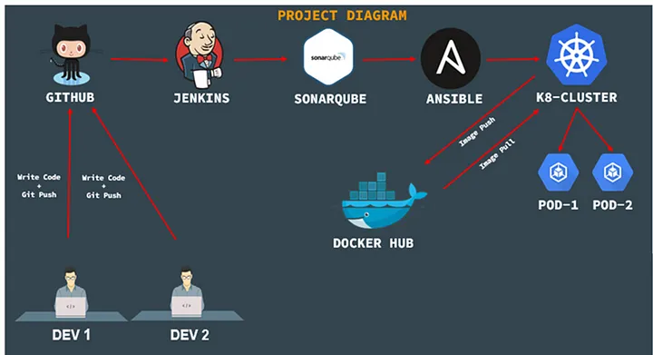
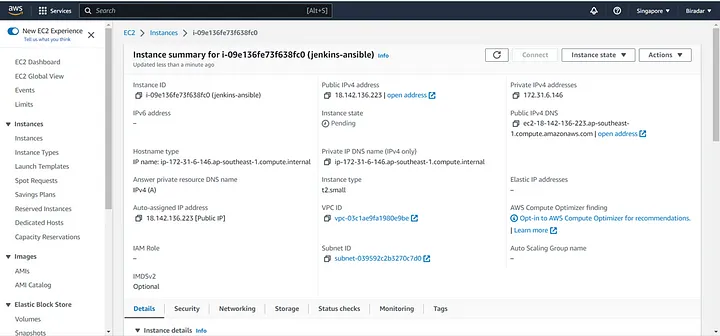

# Jenkins Pipeline for java base web application using Maven, SonarQube, Ansible, and (EKS) Kubernetes

The project involves for Java-based web application using Maven, SonarQube, Ansible, and EKS (Kubernetes).



**Version Control**: The code is stored in a version control system such as Git, hosted on GitHub. 

**Continuous Integration**: Jenkins is used as a CI server to build the application. whenever there 
is a new code, Jenkins automatically pulls the code from GitHub, builds it using Maven, and runs 
automated tests. If the tests fail, the build is marked as failed and then the team is notified.

**Containerization**: Docker is used to containerize the Java application. The Docker file is stored
in the Git repository along with the source code. The docker file specifies the environment and dependencies 
required to run the application.

**Container registry**: The Docker image is pushed to Docker Hub, a public or private Docker Registry. 
The Docker image can be versioned and tagged for easy identification.

**Continuous Deployment**: Webhooks are used to automate the deployment of the containerized application 
to Kubernetes. Whenever a new version of the application is pushed to  the Git repo, Webhook will automatically 
deploy it to the Kubernetes cluster.

Overall, this project demonstrates how to integrate various tools commonly used in software development to 
streamline the development process, improve code quality, and automate deployment

Configure all the below pre-requisites for the project.

1. Install Jenkins & Ansible & Maven

2. Install Sonarqube

3. Install Kubernetes Cluster

4. Git Account

5. Dockerhub Account

@@ Install Jenkins & Ansible & Maven @@

**************** JENKINS INSTALLATION *****************

Pre-Requisites

Jenkins -Ansible Server Details:

Operating System: Ubuntu

Hostname: jenkins-ansible

RAM: 2 GB

CPU: 1 Core

EC2 Instance: t2.small



Update the repository of Ubuntu: 

```
sudo -i
sudo apt-get update
```

Change timezone:

```
date
timedatectl
sudo timedatectl set-timezone America/Chicago
timedatectl
date
```

Change hostname:

```
hostname
hostnamectl set-hostname jenkins-ansible
bash
hostname
```

Install Java

```
java -version
apt-get install openjdk-11-jdk
java -version
```

Install Jenkins:

```
curl -fsSL https://pkg.jenkins.io/debian-stable/jenkins.io-2023.key | sudo tee \
/usr/share/keyrings/jenkins-keyring.asc > /dev/null
echo deb [signed-by=/usr/share/keyrings/jenkins-keyring.asc] \
https://pkg.jenkins.io/debian-stable binary/ | sudo tee \
/etc/apt/sources.list.d/jenkins.list > /dev/null
sudo apt-get update
sudo apt-get install jenkins=2.361.3 -y
```

Service start, enable and check status:

```
systemctl start jenkins
systemctl enable jenkins
systemctl status jenkins
```

